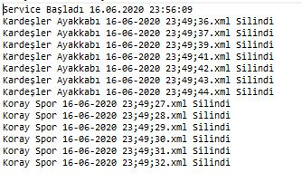

# SUPPLIER DEMO PROJECT

* This project about WCF and Windows Service. WCF have  good dependency injection and ninject.

* Project is very good sample for WCF consuming.

* If suppliers click the green button, project take backup xml data.
* Windwos service delete the xml backups every 5 seconds.

### XML Backups

### Windows Service Steps

* Service install 

* Service Start 

* Service Notes

* Service Uninstall

